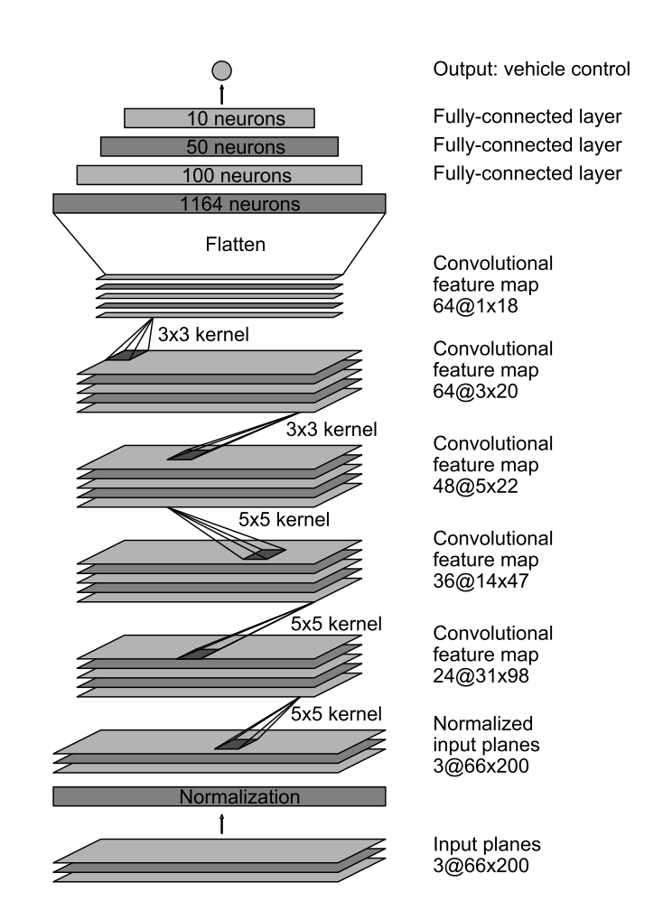

#**Behavioral Cloning** 

##Writeup Template

###You can use this file as a template for your writeup if you want to submit it as a markdown file, but feel free to use some other method and submit a pdf if you prefer.

---

**Behavioral Cloning Project**

The goals / steps of this project are the following:
* Use the simulator to collect data of good driving behavior
* Build, a convolution neural network in Keras that predicts steering angles from images
* Train and validate the model with a training and validation set
* Test that the model successfully drives around track one without leaving the road
* Summarize the results with a written report

--

## Project structure

My project includes the following files:

* **assets/** containing the figures for this report
* **data/** containing the sample training data from [Udacity](https://d17h27t6h515a5.cloudfront.net/topher/2016/December/584f6edd_data/data.zip)
* **logs/** containing the training logs from Keras
* **model.py** containing the script to create and train the model
  + **image_utils.py** containing helper functions for images augmentation
  + **generate_utils.py** containing helper functions to generate/preprocess images for training and validating
  + **os_utils.py** containing helper functions for saving trained models 
* **drive.py** for driving the car in autonomous mode
* **model_{activation}_drop.json** containing the CNN's architecture, while **model_{activation}_drop.h5** containing the weights of a trained CNN
* **writeup_report.md** summarizing the results

Using the Udacity provided simulator and my drive.py file, the car can be driven autonomously around the track by executing 

```sh
python drive.py model_elu_drop.json
```

One can try executing another trained model, with different activation layer (ReLU), by executing

```sh
python drive.py model_relu_drop.json
```

The model.py file contains the code for training and saving the convolution neural network. The file shows the pipeline I used for training and validating the model, and it contains comments to explain how the code works.

---

## Model Architecture and Training Strategy

###1. Data

We use the sample data from [Udacity](https://d17h27t6h515a5.cloudfront.net/topher/2016/December/584f6edd_data/data.zip).

From each timestamp, we got three recorded picture from the simulator:

| Left Camera | Center Camera | Right Camera |
|-------------|---------------|--------------|
|  |  |  | 

The images will be preprocess before putting into the CNN as follow:


###2. Model architecture

The model architecture is borrowed from NVIDIA paper [End to End Learning for Self-Driving Cars](https://images.nvidia.com/content/tegra/automotive/images/2016/solutions/pdf/end-to-end-dl-using-px.pdf).



Furthermore, several modifications have been added.

+ Batch Normalizations: A batch normalization layer is added after each 2D Convolution layer. This is an alternative option for weight initialization, by forcing the activations throughout a network to take on a unit gaussian distribution at the beginning of the training. From a practical point of view, it has been shown that this approach is more robust than a bad initialization. Additionally, batch normalization can be interpreted as doing preprocessing at every layer of the network, but integrated into the network itself in a differentiably manner.

+ Dropouts: A dropout layer is added after each max pooling layer. This is to prevent the overfitting problem.

This is the output of model.summary()

```sh
Using TensorFlow backend.
____________________________________________________________________________________________________
Layer (type)                     Output Shape          Param #     Connected to
====================================================================================================
lambda_1 (Lambda)                (None, 64, 64, 3)     0           lambda_input_1[0][0]
____________________________________________________________________________________________________
convolution2d_1 (Convolution2D)  (None, 32, 32, 24)    1824        lambda_1[0][0]
____________________________________________________________________________________________________
batchnormalization_1 (BatchNorma (None, 32, 32, 24)    96          convolution2d_1[0][0]
____________________________________________________________________________________________________
activation_1 (Activation)        (None, 32, 32, 24)    0           batchnormalization_1[0][0]
____________________________________________________________________________________________________
maxpooling2d_1 (MaxPooling2D)    (None, 31, 31, 24)    0           activation_1[0][0]
____________________________________________________________________________________________________
dropout_1 (Dropout)              (None, 31, 31, 24)    0           maxpooling2d_1[0][0]
____________________________________________________________________________________________________
convolution2d_2 (Convolution2D)  (None, 16, 16, 36)    21636       dropout_1[0][0]
____________________________________________________________________________________________________
batchnormalization_2 (BatchNorma (None, 16, 16, 36)    144         convolution2d_2[0][0]
____________________________________________________________________________________________________
activation_2 (Activation)        (None, 16, 16, 36)    0           batchnormalization_2[0][0]
____________________________________________________________________________________________________
maxpooling2d_2 (MaxPooling2D)    (None, 15, 15, 36)    0           activation_2[0][0]
____________________________________________________________________________________________________
dropout_2 (Dropout)              (None, 15, 15, 36)    0           maxpooling2d_2[0][0]
____________________________________________________________________________________________________
convolution2d_3 (Convolution2D)  (None, 8, 8, 48)      43248       dropout_2[0][0]
____________________________________________________________________________________________________
batchnormalization_3 (BatchNorma (None, 8, 8, 48)      192         convolution2d_3[0][0]
____________________________________________________________________________________________________
activation_3 (Activation)        (None, 8, 8, 48)      0           batchnormalization_3[0][0]
____________________________________________________________________________________________________
maxpooling2d_3 (MaxPooling2D)    (None, 7, 7, 48)      0           activation_3[0][0]
____________________________________________________________________________________________________
dropout_3 (Dropout)              (None, 7, 7, 48)      0           maxpooling2d_3[0][0]
____________________________________________________________________________________________________
convolution2d_4 (Convolution2D)  (None, 7, 7, 64)      27712       dropout_3[0][0]
____________________________________________________________________________________________________
batchnormalization_4 (BatchNorma (None, 7, 7, 64)      256         convolution2d_4[0][0]
____________________________________________________________________________________________________
activation_4 (Activation)        (None, 7, 7, 64)      0           batchnormalization_4[0][0]
____________________________________________________________________________________________________
maxpooling2d_4 (MaxPooling2D)    (None, 6, 6, 64)      0           activation_4[0][0]
____________________________________________________________________________________________________
dropout_4 (Dropout)              (None, 6, 6, 64)      0           maxpooling2d_4[0][0]
____________________________________________________________________________________________________
convolution2d_5 (Convolution2D)  (None, 6, 6, 64)      36928       dropout_4[0][0]
____________________________________________________________________________________________________
batchnormalization_5 (BatchNorma (None, 6, 6, 64)      256         convolution2d_5[0][0]
____________________________________________________________________________________________________
activation_5 (Activation)        (None, 6, 6, 64)      0           batchnormalization_5[0][0]
____________________________________________________________________________________________________
maxpooling2d_5 (MaxPooling2D)    (None, 5, 5, 64)      0           activation_5[0][0]
____________________________________________________________________________________________________
dropout_5 (Dropout)              (None, 5, 5, 64)      0           maxpooling2d_5[0][0]
____________________________________________________________________________________________________
flatten_1 (Flatten)              (None, 1600)          0           dropout_5[0][0]
____________________________________________________________________________________________________
dense_1 (Dense)                  (None, 1164)          1863564     flatten_1[0][0]
____________________________________________________________________________________________________
activation_6 (Activation)        (None, 1164)          0           dense_1[0][0]
____________________________________________________________________________________________________
dense_2 (Dense)                  (None, 100)           116500      activation_6[0][0]
____________________________________________________________________________________________________
activation_7 (Activation)        (None, 100)           0           dense_2[0][0]
____________________________________________________________________________________________________
dense_3 (Dense)                  (None, 50)            5050        activation_7[0][0]
____________________________________________________________________________________________________
activation_8 (Activation)        (None, 50)            0           dense_3[0][0]
____________________________________________________________________________________________________
dense_4 (Dense)                  (None, 10)            510         activation_8[0][0]
____________________________________________________________________________________________________
activation_9 (Activation)        (None, 10)            0           dense_4[0][0]
____________________________________________________________________________________________________
dense_5 (Dense)                  (None, 1)             11          activation_9[0][0]
====================================================================================================
Total params: 2,117,927
Trainable params: 2,117,455
Non-trainable params: 472
```

###3. Training and parameter tuning

This is a regression problem so our goal is to minimize the Mean Square Error of the vehicle control output.

We used `fit_generator` API of the Keras library for training our model, as the training data was too large to fit into our memory. 

``python
history = model.fit_generator(train_gen,
                              samples_per_epoch=number_of_samples_per_epoch,
                              nb_epoch=number_of_epochs,
                              validation_data=valid_gen,
                              nb_val_samples=number_of_validation_samples,
                              verbose=1)
``

The two instances `train_gen` and `valid_gen` are for generating training data and validation data on the fly, respectively. The batch size for both of the generators were 64. We used 25600 images per training epoch, and 6400 images for validation. The ratio of training images versus validation images per each epoch is 80% - 20%.

```python
number_of_samples_per_epoch = 25600
number_of_validation_samples = 6400

train_gen = generate_utils.generate_next_batch()
valid_gen = generate_utils.generate_next_batch()
```

We trained our model within 20 epochs to get the best number of training epoch. We also tried two different activation functions (**ReLU** and **ELU**) to see which will produce the best/more stable outcome.

```python
number_of_epochs = 20
activation_layers = ['relu', 'elu']
```


The model used an Adadelta optimizer, which is a practical choice. It is [recommended](https://keras.io/optimizers/#adadelta) to leave the parameters of this optimizer at their default values in Keras, so we are not tuning for the optimizer learning rate.

###4. Results

The model with the ELU activation layer seemed to work better. We obtained `min_val_loss` of **0.0099** for that model.

```sh
Epoch 1/20
25600/25600 [==============================] - 156s - loss: 0.2167 - val_loss: 0.0732
Epoch 2/20
25600/25600 [==============================] - 154s - loss: 0.0336 - val_loss: 0.0272
Epoch 3/20
25600/25600 [==============================] - 152s - loss: 0.0261 - val_loss: 0.0273
Epoch 4/20
25600/25600 [==============================] - 153s - loss: 0.0217 - val_loss: 0.0196
Epoch 5/20
25600/25600 [==============================] - 149s - loss: 0.0182 - val_loss: 0.0155
Epoch 6/20
25600/25600 [==============================] - 151s - loss: 0.0159 - val_loss: 0.0167
Epoch 7/20
25600/25600 [==============================] - 151s - loss: 0.0147 - val_loss: 0.0125
Epoch 8/20
25600/25600 [==============================] - 152s - loss: 0.0140 - val_loss: 0.0119
Epoch 9/20
25600/25600 [==============================] - 150s - loss: 0.0134 - val_loss: 0.0105
Epoch 10/20
25600/25600 [==============================] - 148s - loss: 0.0130 - val_loss: 0.0115
Epoch 11/20
25600/25600 [==============================] - 153s - loss: 0.0125 - val_loss: 0.0110
Epoch 12/20
25600/25600 [==============================] - 150s - loss: 0.0123 - val_loss: 0.0101
Epoch 13/20
25600/25600 [==============================] - 150s - loss: 0.0121 - val_loss: 0.0099
Epoch 14/20
25600/25600 [==============================] - 152s - loss: 0.0115 - val_loss: 0.0100
Epoch 15/20
25600/25600 [==============================] - 152s - loss: 0.0117 - val_loss: 0.0109
Epoch 16/20
25600/25600 [==============================] - 152s - loss: 0.0116 - val_loss: 0.0106
Epoch 17/20
25600/25600 [==============================] - 152s - loss: 0.0113 - val_loss: 0.0109
Epoch 18/20
25600/25600 [==============================] - 149s - loss: 0.0110 - val_loss: 0.0100
Epoch 19/20
25600/25600 [==============================] - 150s - loss: 0.0110 - val_loss: 0.0106
Epoch 20/20
25600/25600 [==============================] - 150s - loss: 0.0115 - val_loss: 0.0109
```

One can have a look into the [log\ foler](log\) for more details.

The most suprising thing is that the model seems to work better on the second track: [the first track run](video1.mp4) versus [the second track run](video2.mp4). Still have no idea why that could be the case :)

####5. Recording issues

First, I tried to screen-recording all the process to have the "best" overview for this project. Since the vehicle control parameter is very sensitive, and running simultaneously many "heavy" processes (QuickPlay for recording, Udacity simulator, and the drive.py process) on a four-year-old Macbook with worst quality and lowest resolution still caused the car to fluctuate a lot on the street, and losed its track. Thus, I haved to save the recorded images from the simulator for this project, then rebuild the video later on.

I would love to see how my model running on these tracks on a relative "strong" computer :)

---

## Future works

There are several future approaches that I could think of as additional projects.

1. Training on the model on actual roads data with a real-world data simulator
2. Combining RNN + CNN, which is done by [Comma.ai](https://github.com/commaai/research)
3. Training a Deep Reinforcement Learning model
